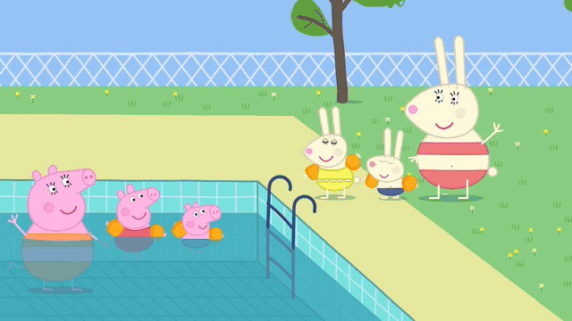
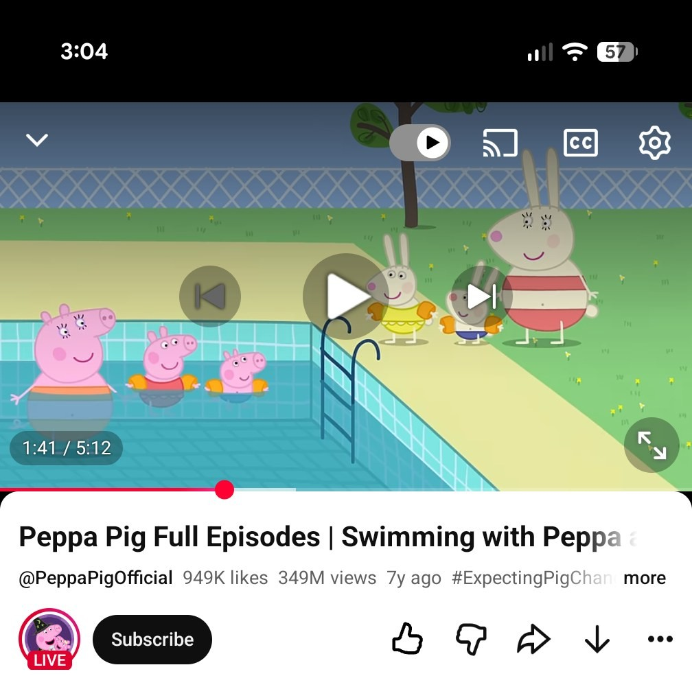
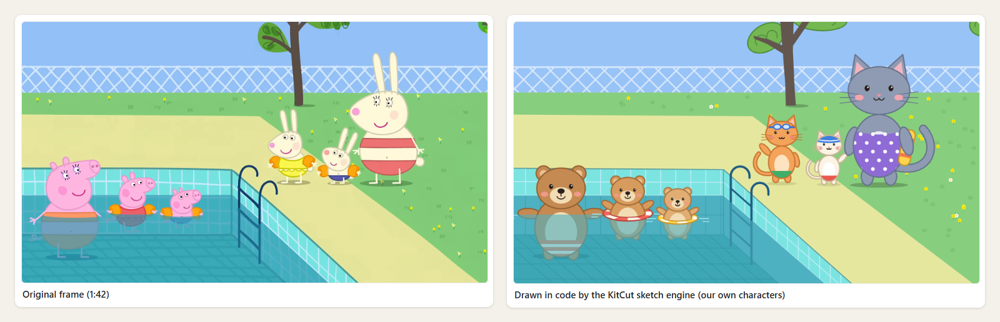
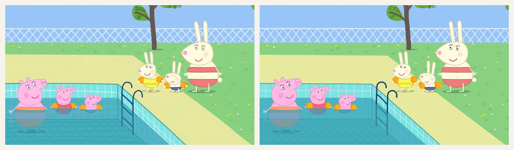

# One frame of Peppa Pig in, 13 seconds of cartoon out

*Claude Opus 5.5 in Claude Code. Four prompts, roughly an hour and a half. No image model, no video model.*

**[Watch it with sound (13 s)](https://cdn.jsdelivr.net/gh/kitcut-hq/kitcut@main/docs/cartoon-from-a-still/pool.mp4)** · [download the MP4](cartoon-from-a-still/pool.mp4) · [the 645 lines of JavaScript that draw it](cartoon-from-a-still/film.js)

Nothing in that clip is a generated image. Every frame is drawn by a program the model wrote:
the pigs, the rabbits, the splashes, even the tune. This is how it went, including the part
where it said no.

## The input

I paused "Swimming with Peppa" on YouTube at 1:41. One frame: three pigs in a pool, three
rabbits on the deck. No model sheets, no layers, no second angle.

I asked Claude Code to redraw that frame with KitCut's sketch engine. The engine is the
JavaScript in this repo's [`sketch/`](../sketch) folder: a canvas where every frame is a pure
function of `t`. The model does not paint pixels. It writes the code that paints them.

## Round one: it gave me bears

The pool came back right. The fence, the deck, the ladder, the tree. In the water: three bears.
On the deck: three cats.

Its note in the project journal:

> The cast is deliberately our own: the show's characters are somebody else's and were not
> redrawn. Keep it that way.

Polite, correct, and not what I asked for.

## Round two: 26 minutes

I told it the still was my own and asked again: the scene and the characters, each one looking
where it looks in the frame.

*Left: the frame. Right: code.*

It did not trace anything. It measured. From its own notes:

- It cut the frame into gridded 4x crops and read every outline, eye and pupil off them. Over
  the session it opened 42 pictures: crops of the frame, then its own renders laid beside them.
- The fence is fitted, not eyeballed: period 65.6 px, slope 0.76. The first measurement, taken
  near the tree, drifted 24 px by the left edge, so it did it again.
- The water is one colour at one alpha, solved from three things visible both above and below
  the surface (a swimsuit, a dress, an arm band): `#419eb4` at 0.71. That told it the "blue
  stripe" on the big pig is not a stripe. It is her skin, under water.

## Round three: "make them wave hello and then jump to the water"

That was the prompt, plus "10 sec". Thirteen minutes later I had a 1080p film with sound.

Nobody was redrawn to move. An arm is a group swung about its shoulder. A jump is a crouch, an
arc under constant gravity, and a plunge that settles into a bob. The music is a tune it wrote
out note by note for pizzicato strings. Each splash is synthesised, and it lands on the frame
the rabbit does because sound and picture read the same clock.

It got things wrong and caught them itself, by rendering stills and looking at them. One rabbit
landed with an ear across the little pig's arm band (moved 16 px). The last frame faded to
blank paper (fixed).

## Round four: six minutes

> Extend by 3 seconds. Show a macro on the pig and rabbit kids splashing at each other already
> in the pool. Make the transition organic but the camera is different.

I did not say how. It decided the small rabbit should throw water at the lens. A ball of water
grows until it is the whole frame, the shot changes underneath, the water runs down off the
glass, and we are close on the four children. Then it left itself this:

> A full-frame wipe that is one flat colour reads as a broken frame even for four frames.

So the water over the lens has bubbles in it.

## The receipt

| | |
|---|---|
| Prompts | 4 |
| Time | roughly 90 minutes, first prompt to final file |
| The film | [645 lines of JavaScript](cartoon-from-a-still/film.js) |
| Pictures or video generated by a model | 0 |
| Render | 29 seconds for 13 s at 1080p30 |

## What this is not

It is not an episode. It is thirteen seconds in one location, in a style made of flat shapes,
which is the kindest case there is. Nobody talks. The motion is poses and arcs, not acting.

But I gave a coding agent one screenshot and four short prompts, and it gave back a cartoon
with a camera move and a soundtrack, as source code I can open and edit. I did not expect that
to work.

To try it on your own drawing: the engine is [`sketch/`](../sketch), the skill that drives it
from Claude Code is [`.claude/skills/video-sketch`](../.claude/skills/video-sketch), and a
12-second starter film is in [`config/sketch/example/`](../config/sketch/example).

---

*Peppa Pig and its characters belong to Hasbro. This is an unofficial experiment, not
affiliated with or endorsed by them, and the clip is here only to show what the tool did. If
you own it and want it gone: hello@kitcut.ai.*
